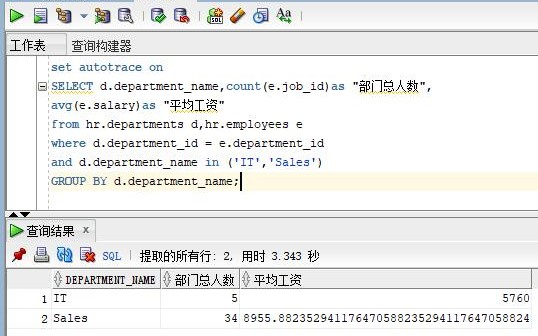
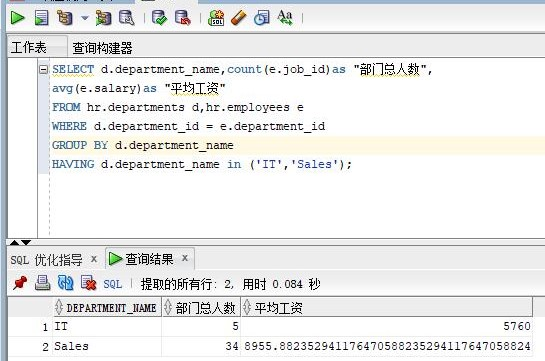
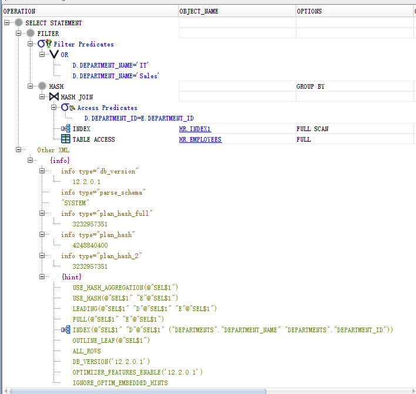
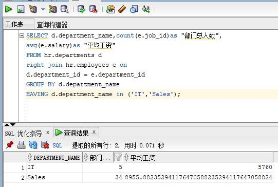

# 实验一：SQL语句的执行计划与优化指导

## 张峻菠              软件工程3班            学号：201810414327 

## 实验目的

分析SQL执行计划，执行SQL语句的优化指导。理解分析SQL语句的执行计划的重要作用。

## 实验内容

1、对Oracle12c中的HR人力资源管理系统中的表进行查询与分析。
2、首先运行和分析教材中的样例：本训练任务目的是查询两个部门('IT'和'Sales')的部门总人数和平均工资，以下两个查询的结果是一样的。但效率不相同。
3、设计自己的查询语句，并作相应的分析，查询语句不能太简单。

#### 查询1

```
SELECT d.department_name,count(e.job_id)as "部门总人数",
avg(e.salary)as "平均工资"
from hr.departments d,hr.employees e
where d.department_id = e.department_id
and d.department_name in ('IT','Sales')
GROUP BY d.department_name;
```
#### 查询1结果



#### 查询1分析

结果：通过创建一个或多个索引可以改进此语句的执行计划
优化：考虑运行可以改进物理方案设计的访问指导或创建推荐的索引
原理：创建推荐的索引|可以显著地改进此语向的执行计划。但是， 使用典型的SQL工作量运行”访问指导”可能比单个语句更可取。通过这种方法可以获得全面的索引建议案，包括计算索引维护的开销和附加的空间消耗。

**sql优化指导**


#### 查询2

```
SELECT d.department_name,count(e.job_id)as "部门总人数",
avg(e.salary)as "平均工资"
FROM hr.departments d,hr.employees e
WHERE d.department_id = e.department_id
GROUP BY d.department_name
HAVING d.department_name in ('IT','Sales');
```
#### 查询2结果



#### 查询2分析

我认为查询2运行时间更短，效率更好，整体运行效率已经非常好！是最优的，sqlserver没有提示可优化的地方。

**执行计划**



### 代码改进

```
SELECT d.department_name,count(e.job_id)as "部门总人数",
avg(e.salary)as "平均工资"
FROM hr.departments d
inner join hr.employees e on 
d.department_id = e.department_id
GROUP BY d.department_name
HAVING d.department_name in ('IT','Sales');
```
### 查询结果



#### 自定义查询分析

通过运用右连接引入e.department_id表,并且索引d.peartment_id = e.department_id来限制条件，使查询速度快上了0.013s。sqlserver没有提出优化建议。

### 实验总结

> 对两条SQL语句进行了运行并且比较，发现SQL语句1比SQL语句2耗时短，并且效率高。原因是SQL语句1是先筛选出了结果在进行select出结果，而SQL语句2则没有那么灵活，所以SQL语句1是最优的。

