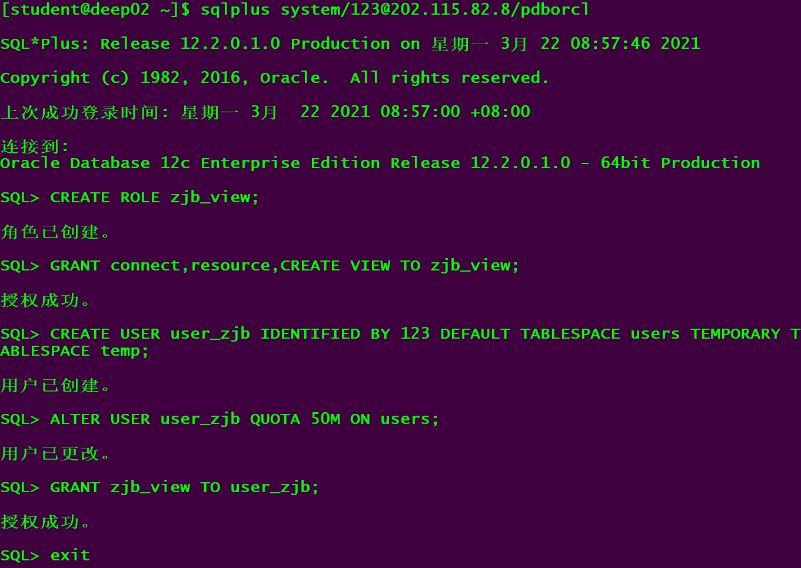
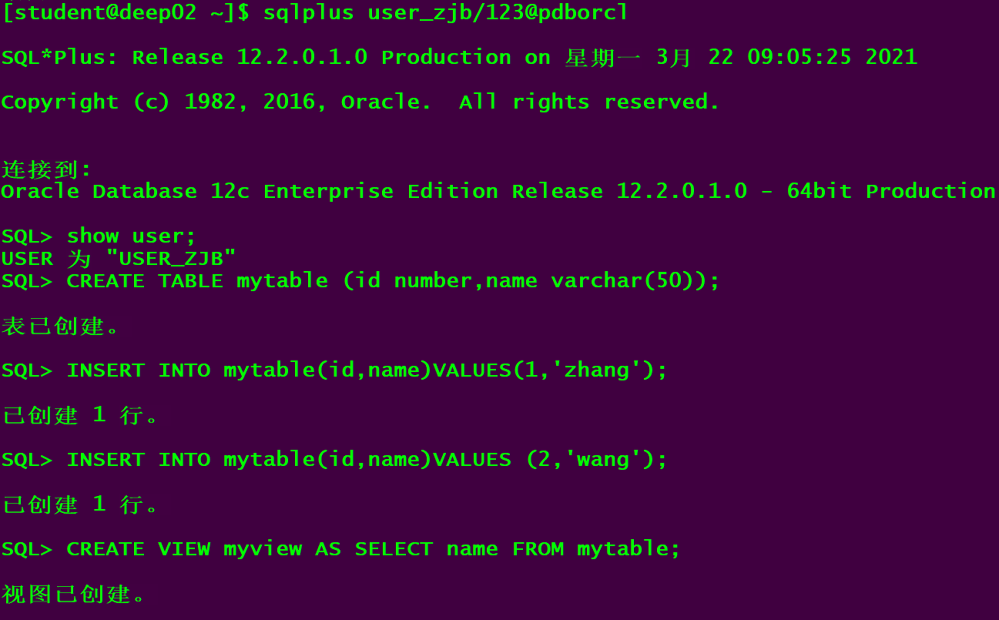
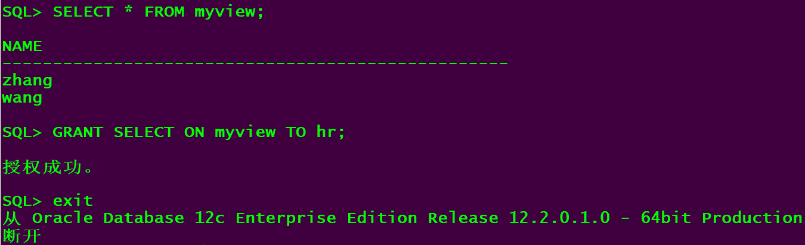
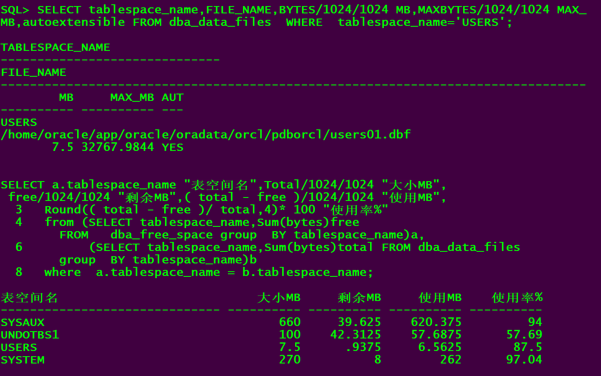
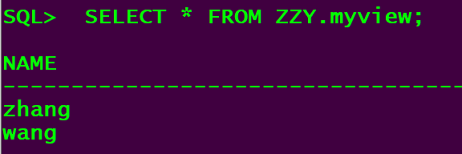

# 实验二：用户及权限管理

## 姓名：张峻菠     学号：201810414327     18软工3班

### 实验目的：

掌握用户管理、角色管理、权根维护与分配的能力，掌握用户之间共享对象的操作技能。

### 实验内容：

Oracle有一个开发者角色resource，可以创建表、过程、触发器等对象，但是不能创建视图。本训练要求：

- 在pdborcl插接式数据中创建一个新的本地角色con_res_view，该角色包含connect和resource角色，同时也包含CREATE VIEW权限，这样任何拥有con_res_view的用户就同时拥有这三种权限。
- 创建角色之后，再创建用户new_user，给用户分配表空间，设置限额为50M，授予con_res_view角色。
- 最后测试：用新用户new_user连接数据库、创建表，插入数据，创建视图，查询表和视图的数据。

## 实验步骤：

对于以下的对象名称con_res_view，new_user，在实验的时候应该修改为自己的名称。

- 第1步：以system登录到pdborcl，创建角色con_res_view和用户new_user，并授权和分配空间：

```
$ sqlplus sys/123@pdborcl as sysdba
SQL> CREATE ROLE con_res_view;
Role created.
SQL> GRANT connect,resource,CREATE VIEW TO con_res_view_ll;
Grant succeeded.
SQL> CREATE USER new_user_ll IDENTIFIED BY 123 DEFAULT TABLESPACE users TEMPORARY TABLESPACE temp;
User created.
SQL> ALTER USER new_user_ll QUOTA 50M ON users;
User altered.
SQL> GRANT con_res_view TO new_user;
Grant succeeded.
SQL> exit
```

> 语句“ALTER USER new_user QUOTA 50M ON users;”是指授权new_user用户访问users表空间，空间限额是50M。
>
> 

- 第2步：新用户new_user连接到pdborcl，创建表mytable和视图myview，插入数据，最后将myview的SELECT对象权限授予hr用户。

```
$ sqlplus new_user/123@pdborcl
SQL> show user;
USER is "NEW_USER"
SQL> CREATE TABLE lltable (id number,name varchar(50));
Table created.
SQL> INSERT INTO lltable(id,name)VALUES(1,'zhang');
1 row created.
SQL> INSERT INTO lltable(id,name)VALUES (2,'wang');
1 row created.
SQL> CREATE VIEW llview AS SELECT name FROM mytable;
View created.
SQL> SELECT * FROM llview;
NAME
--------------------------------------------------
zhang
wang
SQL> GRANT SELECT ON llview TO hr;
Grant succeeded.
SQL>exit
```



- 第3步：用户hr连接到pdborcl，查询new_user授予它的视图myview

```
$ sqlplus hr/123@pdborcl
SQL> SELECT * FROM new_user.llview;
NAME
--------------------------------------------------
zhang
wang
SQL> exit
```




## 查看数据库的使用情况

以下样例查看表空间的数据库文件，以及每个文件的磁盘占用情况。

```sql
SELECT tablespace_name,FILE_NAME,BYTES/1024/1024 MB,MAXBYTES/1024/1024 MAX_MB,autoextensible FROM dba_data_files  WHERE  tablespace_name='USERS';
SELECT a.tablespace_name "表空间名",Total/1024/1024 "大小MB",
 free/1024/1024 "剩余MB",( total - free )/1024/1024 "使用MB",
 Round(( total - free )/ total,4)* 100 "使用率%"
 from (SELECT tablespace_name,Sum(bytes)free
        FROM   dba_free_space group  BY tablespace_name)a,
       (SELECT tablespace_name,Sum(bytes)total FROM dba_data_files
        group  BY tablespace_name)b
 where  a.tablespace_name = b.tablespace_name;
```



- autoextensible 是显示表空间中的数据文件是否自动增加。

- MAX_MB 是指数据文件的最大容量。

  #### 数据库和表空间占用分析

    数据库pdborcl中包含了con_ress_view角色和new_users用户。 使用表空间users存储表的数据。 表空间中存储了很多相同名称的表mytable和视图myview，但分别属性于不同的用户，不会引起混淆。 随着用户往表中插入数据，表空间的磁盘使用量会增加。

> 测试一下同学用户之间的表的共享，只读共享和读写共享都测试一下。

## 共享测试



### 分析

本次实验主要是进行数据库用户操作，对用户进行权限管理操作，首先连接上老师的数据库然后创建自己的用户进行实验。创建表，将权限用grant授予创建的表中。如果有一组用户，所需权限是一样的，就像本次实验，几十个同学执行一样的权限，会发生冲突，并且会出现很多重复的授权命令，所以在实验开始前，创建角色，将角色赋给用户，就会好操作一些。

 