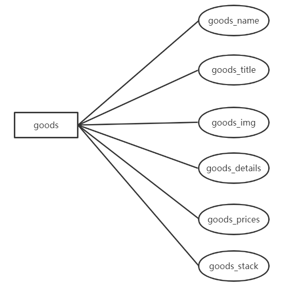
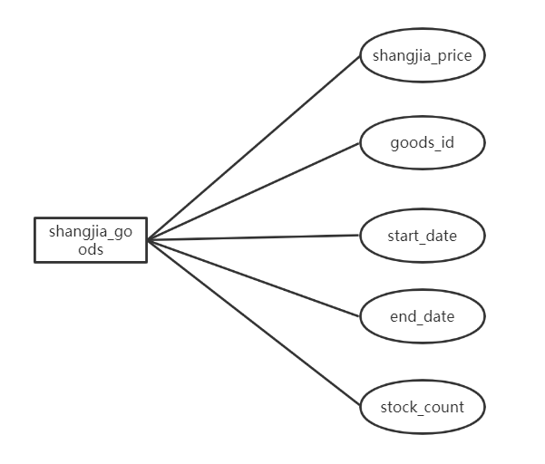
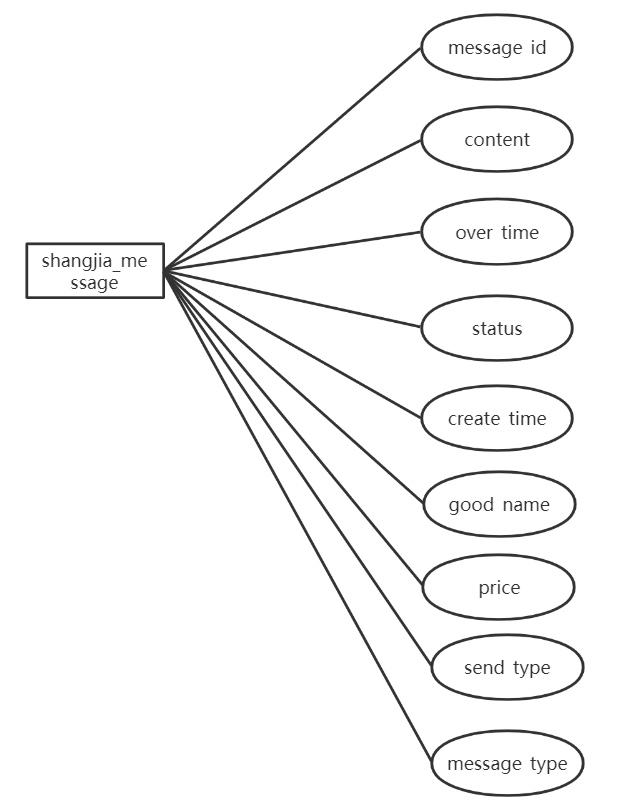
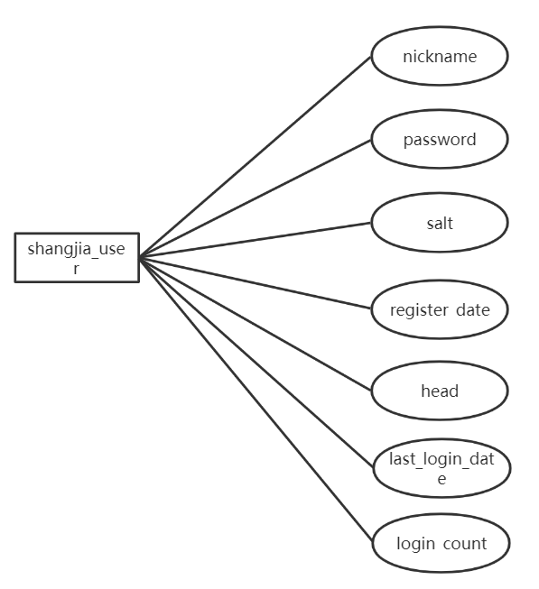
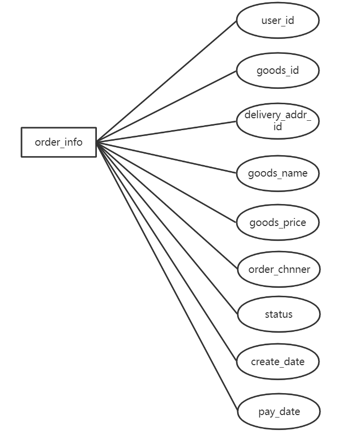
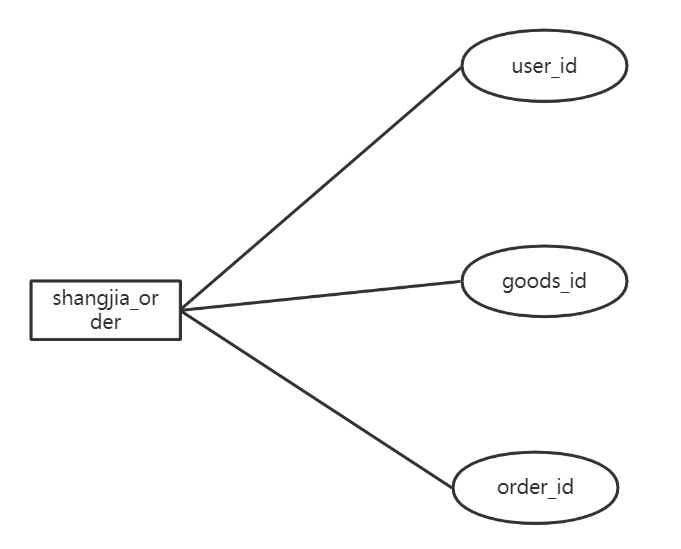
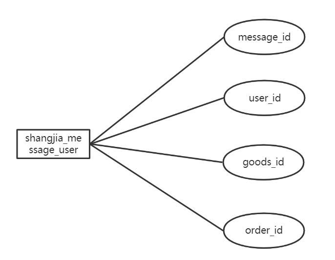
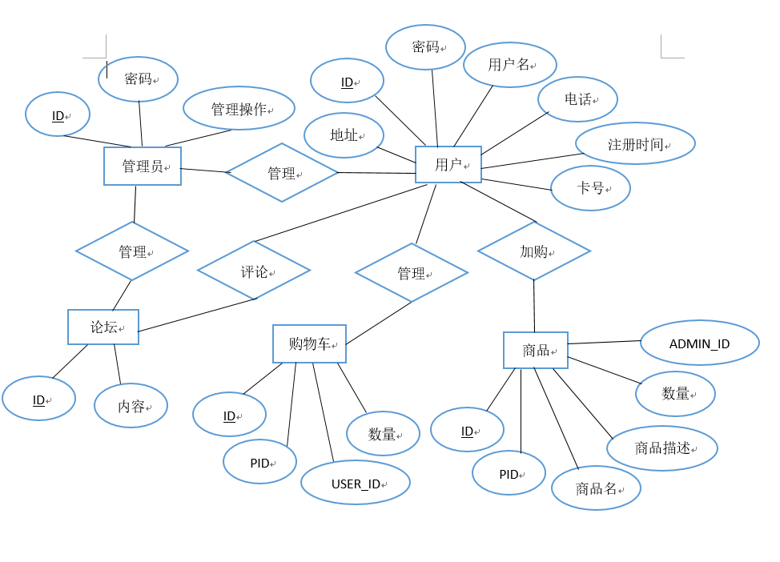
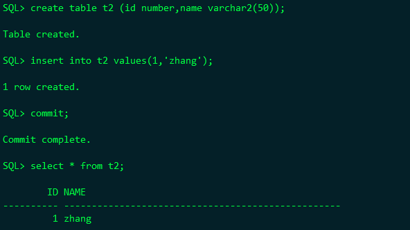

# 在线购物系统数据设计
## 一、引言
随着Internet的发展和电子商务的日益普及，网络购物可以使顾客足不出户便可以方便快捷地选购自己喜欢的商品，比如生活用品、图书等。因此，需要在线购物系统为网上交易活动提供一个高效、低成本的平台。该在线购物系统能够满足用户进行网上交易活动的各项要求，能够使用户足不出户便可以方便快捷地选购自己喜欢的商品。
## 二、数据库设计
数据库中有8张表，分别是goods（商品表），shangjia_user(在线购物用户)，shangjia_goods（上架商品表），shangjia_message（上架信息表），shangjia_message_user（上架信息用户表），shangjia_order(订单表)，order_info(订单详表).

### 实体属性：
#### 商品实体：
属性的意思分别为goods_name（商品名称），goods_title（商品标题），goods_img（商品图片），goods_details（商品的详细描述），goods_prices（商品价格），goods_stack（商品的库存）。


#### 在线购物商品实体：
shangjia_price（在线购物价格），goods_id（商品id），start_date（开始在线购物的时间），end_date（在线购物结束的时间），stock_count（库存数量）。


#### 在线购物信息实体；
message_id(信息id), content(信息内容), over_time(结束时间), status(状态), create_time(创建时间), good_name(商品名称), price(价格), send_type(发送类型), message_type(0 在线购物消息 1 购买消息 2 推送消息).



#### 在线购物用户实体；
Nickname(昵称), password(密码), salt， head(头像), register_date(注册日期), last_login_date(最后登录日期), login_count(登录次数).



#### 订单详情实体：
User_id(用户id), goods_id(商品id), delivery_addr_id(邮寄方式), goods_name(商品名称), goods_price(商品价格), order_chnner(1pc，2android，3ios), status(订单状态), create_date(创建日期), pay_date(付款日期).




#### 关联表：
shangjia_order（在线购物-订单-商品），是将用户，商品、订单三张表关联起来的数据表。


shangjia_message_user（用户-信息-商品-订单），是将用户、商品、信息、订单关联起来的表。




##### E-R图
简易的e-r图，如下：




## 三、表和数据添加
### 一、建表和插入数据
如下是本次数据库的建表sql，使用的是pl/sql语言写的一个文件。
在建表之前应该判断数据库中是否有该表的存在，如果有删除，如果没有，则执行建表语句。
这里使用的是查找该表中的数据条数，来判断是是否有表，然后执行drop table 来删除表。Declare表示申明，begin表示执行开始，需要在结尾加上end；/ 表示执行以上所有代码。
```sql
declare
      num   number;
begin
      select count(1) into num from user_tables where TABLE_NAME = 'GOODS';
      if   num=1   then
          execute immediate 'drop table GOODS cascade constraints PURGE';
      end   if;
      
      select count(1) into num from user_tables where TABLE_NAME = 'shangjia_GOODS';
      if   num=1   then
          execute immediate 'drop table shangjia_GOODS cascade constraints PURGE';
      end   if;
      
      select count(1) into num from user_tables where TABLE_NAME = 'shangjia_MESSAGE';
      if   num=1   then
          execute immediate 'drop table shangjia_MESSAGE cascade constraints PURGE';
      end   if;
      
      select count(1) into num from user_tables where TABLE_NAME = 'shangjia_MESSAGE_USER';
      if   num=1   then
          execute immediate 'drop table shangjia_MESSAGE_USER cascade constraints PURGE';
      end   if;
      
      select count(1) into num from user_tables where TABLE_NAME = 'shangjia_ORDER';
      if   num=1   then
          execute immediate 'drop table shangjia_ORDER cascade constraints PURGE';
      end   if;
      
      select count(1) into num from user_tables where TABLE_NAME = 'shangjia_USER';
      if   num=1   then
          execute immediate 'drop table shangjia_USER cascade constraints PURGE';
      end   if;
      
       select count(1) into num from user_tables where TABLE_NAME = 'ORDER_INFOR';
      if   num=1   then
          execute immediate 'drop table ORDER_INFOR cascade constraints PURGE';
      end   if;
      
      select count(1) into num from user_tables where TABLE_NAME = 'USERS';
      if   num=1   then
          execute immediate 'drop table USERS cascade constraints PURGE';
      end   if;
end;
/

```
以下是建表语句，根据数据字段的设计，在数据库中设计数据库表，这里不赘述。
```sql
--创建goods 表
CREATE TABLE GOODS (
  ID NUMBER(6, 0) NOT NULL ,
  GOODS_NAME VARCHAR2(16 BYTE) DEFAULT NULL,
  GOODS_TITLE VARCHAR2(64 BYTE) DEFAULT NULL,
  GOODS_IMG VARCHAR2(64 BYTE) DEFAULT NULL,
  GOODS_DETAILS VARCHAR2(100 BYTE) ,
  GOODS_PRICE NUMBER(10,2)DEFAULT '0.00',
  GOODS_STAOCK NUMBER(11,0)
--  PRIMARY KEY (`id`)
) ;

-- 创建shangjia_goods表
CREATE TABLE shangjia_GOODS(
    ID NUMBER(6,0) NOT NULL,
    GOODS_ID NUMBER(20, 0) DEFAULT NULL,
    shangjia_PRICE NUMBER(10,2) DEFAULT '0.00',
    STOCK_COUNT NUMBER(11) DEFAULT NULL,
    START_DATE DATE  DEFAULT NULL,
    END_DATE DATE  DEFAULT NULL
--    PRIMARY KEY (`id`)
);

--创建shangjia_message表
CREATE TABLE shangjia_MESSAGE(
    ID NUMBER(20, 0) NOT NULL,
    MESSAGE_ID NUMBER(20,0) NOT NULL,
    CONTENT VARCHAR2(100) ,
    CREATE_TIME DATE DEFAULT NULL ,
    STATUS NUMBER(1,0) NOT NULL ,
    OVER_TIME DATE DEFAULT NULL,
    MESSAGE_TYPE NUMBER(1, 0) DEFAULT '3' ,
    SEND_TYPE NUMBER(1) DEFAULT '3' ,
    GOOD_NAME VARCHAR2(50) DEFAULT '' ,
    PRICE NUMBER(10,2) DEFAULT '0.00' 
--    PRIMARY KEY (`id`)
);

--创建shangjia_message_user
CREATE TABLE shangjia_MESSAGE_USER(
    ID NUMBER(20) NOT NULL,
    USER_ID NUMBER(20) NOT NULL,
    MESSAGE_ID NUMBER(38) NOT NULL,
    GOODS_ID NUMBER(20) DEFAULT NULL,
    ORDER_ID NUMBER(20) DEFAULT NULL
);

--创建表shangjia_order表
CREATE TABLE shangjia_ORDER(
    ID NUMBER(20) NOT NULL ,
    USER_ID NUMBER(20) DEFAULT NULL ,
    ORDER_ID NUMBER(20) DEFAULT NULL ,
    GOODS_ID NUMBER(20) DEFAULT NULL 
);

--创建表shangjia_user
CREATE TABLE shangjia_USER(
    ID NUMBER(20) NOT NULL,
    USER_ID NUMBER(20) DEFAULT NULL,
    NICKNAME VARCHAR2(255) NOT NULL,
    PASSWORD VARCHAR2(32) DEFAULT NULL ,
    SALT VARCHAR2(10) DEFAULT NULL,
    HEAD VARCHAR2(128) DEFAULT NULL ,
    REGISTER_DATE DATE DEFAULT NULL ,
    LAST_LOGIN_DATE DATE DEFAULT NULL ,
    LOGIN_COUNT NUMBER(11) DEFAULT '0'
);
-- 创建表order_info
CREATE TABLE ORDER_INFOR (
  ID NUMBER(20) NOT NULL,
  ORDER_ID NUMBER(20) DEFAULT NULL,
  USER_ID NUMBER(20) DEFAULT NULL,
  GOODS_ID NUMBER(20) DEFAULT NULL ,
  DELIVERY_ADDR_ID NUMBER(20) DEFAULT NULL,
  GOODS_NAME VARCHAR2(16) DEFAULT NULL ,
  GOODS_COUNT NUMBER(11) DEFAULT '0',
  GOODS_PRICE NUMBER(10,2) DEFAULT '0.00',
  ORDER_CHANNER NUMBER(4) DEFAULT '0',
  STATUS NUMBER(4) DEFAULT '0',
  CREATE_DATE DATE DEFAULT NULL,
  PAY_DATE DATE DEFAULT NULL
) ;
```
### 二、数据库表导入相应数据
使用pl/sql语句来添加数据。
#### --1、向goods表中添加数据
这里定义了6个数组，数据库表中的每个字段随机从每个数组中选取数据，构成一个记录，插入到数据库中相应表中，数据条数为10000条。
```sql
set SERVEROUTPUT ON;
create or replace function RANDOM
    return number 
    is 
        a number ; 
    begin
        select round(dbms_random.value(1,5)) rnum
        into a 
        from dual;
        return a  ;
    end;
    /

DECLARE
    type goods_name is varray(5) of varchar2(20);
    type goods_details is varray(5) of VARCHAR2(100);
    type goods_img is varray(5) of VARCHAR2(20);
    type goods_info is varray(5) of VARCHAR2(50);
    type goods_price is varray(5) of VARCHAR2(20);
    type goods_have is varray(5) of VARCHAR2(20);

    indexRandom NUMBER;
    goods_name_list goods_name:=goods_name('iphoneX','华为Meta9','小米6','一加','vivo'); 
    goods_details_list goods_details:=goods_details('64GB 银色 移动联通电信4G手机','4GB+32GB版 移动联通电信4G手机 双卡双待','64GB 银色 移动联通电信3G手机','月光银 移动联通电信4G手机','玫瑰金 64g 晓龙a382'); 
    goods_img_list goods_img:=goods_img('/img/iphonex.png','/img/meta10.png','/img/iphone8.png','/img/mi6.png','/img/mi9.png'); 
    goods_info_list goods_info:=goods_info('移动联通电信4G手机','4GB+32GB版','月光银','玫瑰金','64GB 银色'); 
    goods_price_list goods_price:=goods_price('8765.00','3212.00','5589.00','3212.00','7212.00'); 
    goods_have_list goods_have:=goods_have('8765','-1','558','3212','7212'); 
 BEGIN
    dbms_output.put_line(indexRandom);
    DBMS_OUTPUT.PUT_LINE(goods_name_list(5));
    for i in 1..10000
    loop
        indexRandom:=RANDOM();
        INSERT INTO GOODS VALUES (i, goods_name_list(indexRandom), goods_details_list(indexRandom), goods_img_list(indexRandom), goods_info_list(indexRandom), goods_price_list(indexRandom), goods_have_list(indexRandom));
    end loop;
 
 END;
 /

```
#### --2、向shangjia_goods中添加数据
使用for loop语句构造2到2000 的数据，然后根据i值的不同，其后的数据相同，数据条数为2000条，插入到数据库中。
```sql
declare
    result number;
begin
    for i in 2..2000
    loop
        result:=i mod 3;
        if result =0 then
            INSERT INTO shangjia_GOODS VALUES (i, i, '0.01', '9', ('04-12月-17'), ('04-12月-17'));
            DBMS_OUTPUT.PUT_LINE(i);
        elsif result = 1 then
            INSERT INTO shangjia_GOODS VALUES (i, i, '0.25', '12', ('08-11月-18'), ('08-11月-18'));
            DBMS_OUTPUT.PUT_LINE(i);
        else
            INSERT INTO shangjia_GOODS VALUES (i, i, '0.05', '8', ('12-11月-17'), ('12-11月-19'));
            DBMS_OUTPUT.PUT_LINE(i);
        end if;
        exit when i=2000;
    end loop;
end;
/

#### --3、向shangjia_message 中添加数据
如上面的导入数据方式，使用i值的不同，构造不同记录。
declare
begin
    for i in 2..5000
    loop
        INSERT INTO shangjia_MESSAGE VALUES (i,'533324506110885888', '尊敬的用户你好，你已经成功注册！', null, '0', null, null, '0', null, null);
    end loop;
end;
/

#### -- shangjia_user
declare
    id number;
    user_id number;
    nickname number;
begin
    id:=18912341247;
    nickname:=18612766444;
    user_id:=1;
    loop
        id:=id+1;
        user_id:=user_id+1;
        nickname:=nickname+1;
        INSERT INTO shangjia_USER VALUES (id, user_id, nickname, 'b7797cce01b4b131b433b6acf4add449', '1a2b3c4d', null, '11-1月-19', null, '0');
        exit when id=18912344246;
    end loop;
end;
/
#### --4、向order_info中添加数据
导入order_info使用的是循环loop….end，创建变量order_id,user_id，goods_id，并赋以初值，然后在执行完一条insert之后，是这些变量的值进行相应的改变，达到数据导入的目的。
DECLARE
--    INSERT INTO `order_info` VALUES ('1564', '18912341234', '3', null, 'iphone8', '1', '0.01', '1', '0', '2017-12-16 16:35:20', null);
    ORDER_ID NUMBER;
    USER_ID NUMBER;
    GOODS_ID NUMBER;
    ID NUMBER:=1;
BEGIN
--20000
    ORDER_ID:=1564;
    USER_ID:=1;
    GOODS_ID:=1;
    LOOP
        INSERT INTO ORDER_INFOR VALUES(ID, ORDER_ID, USER_ID, GOODS_ID,null, 'iphone8', '1', '0.01', '1', '0', '16-12月-17', null);
        ORDER_ID:=ORDER_ID+1;
        USER_ID:=USER_ID+1;
        GOODS_ID:=GOODS_ID+1;
        EXIT ???
    END LOOP;
END;
/

```
## 四、ORACLE中相关配置
首先就是新建pdb 的操作，oracle没有办法对cdb进行操作，只能操作pdb，所以在oracle中的开始，我就需要新建一个pdb数据库，以上的相关操作，都是建立在这次之后的操作，这里新建一个salespdb的pdb数据库。
大致解释以下语句的含义：
Create pluggable database 就是新建一个pdb的语句，其中salespdb是数据库的名称，然后就是用户名和密码，使用的tablespace的大小，默认的存储文件地址。
```sql
CREATE PLUGGABLE DATABASE salespdb ADMIN USER sale5deng IDENTIFIED BY sale5deng STORAGE (MAXSIZE 2G) DEFAULT TABLESPACE sales DATAFILE '/database/oracle/oracle/oradata/orcl/salespdb/sales01.dbf' SIZE 250M AUTOEXTEND ON PATH_PREFIX = '/database/oracle/oracle/oradata/orcl/salespdb/' FILE_NAME_CONVERT = ('/database/oracle/oracle/oradata/orcl/pdbseed/', '/database/oracle/oracle/oradata/orcl/salespdb/');
```
#### 一、表设计
创建表空间的过程，创建了三个表空间，分别叫做sales，sales02，sales03，大小最大为50M，数据文件存放在/database/oracle/oracle/oradata/orcl/orclpdb/目录下面。
```sql
CREATE TABLESPACE SALES 
DATAFILE '/database/oracle/oracle/oradata/orcl/salespdb/sales.dbf' 
SIZE 100M AUTOEXTEND ON NEXT 50M MAXSIZE UNLIMITED 
EXTENT MANAGEMENT LOCAL SEGMENT SPACE MANAGEMENT AUTO;

CREATE TABLESPACE USERS01 
DATAFILE '/database/oracle/oracle/oradata/orcl/ salespdb / sales02.dbf' 
SIZE 100M AUTOEXTEND ON NEXT 50M MAXSIZE UNLIMITED 
EXTENT MANAGEMENT LOCAL SEGMENT SPACE MANAGEMENT AUTO;

CREATE TABLESPACE USERS02 
DATAFILE '/database/oracle/oracle/oradata/orcl/ salespdb / sales03.dbf' 
SIZE 100M AUTOEXTEND ON NEXT 50M MAXSIZE UNLIMITED 
EXTENT MANAGEMENT LOCAL SEGMENT SPACE MANAGEMENT AUTO;

```
#### 二、用户管理
##### 创建用户
这里创建了两个用户，分别叫做sale5deng和buyer5deng
```sql
SYSTEM@192.168.44.183:1521/salespdb>create role sales5deng identified sales5deng;
角色已创建。

SYSTEM@192.168.44.183:1521/salespdb>create role buyer5deng identified buyer5deng;
角色已创建。
##### 权限配置
给刚创建的两个用户添加connect，resource，create view的权限

SYSTEM@192.168.44.183:1521/salespdb>grant connect, resource, CREATE VIEW TO sales5deng;
授权成功。

SYSTEM@192.168.44.183:1521/salespdb>grant connect, resource, CREATE VIEW TO buyer5deng;
授权成功。
```
##### 表空间分配
数据库中有三个刚才创建的表空间，分别为sales，sales02，sales03.
```sql
SYSTEM@192.168.44.229:1521/salespdb>select tablespace_name from user_tablespaces;

TABLESPACE_NAME
------------------------------
SYSTEM
SYSAUX
UNDOTBS1
TEMP
SALES
SALES02
SALES03

已选择 7 行。
```

#### 三、PL/SQL设计
查找shangjia_order 表中的数据，使用shangjia_user的user_id，使用存储过程queryUser传入user_id，从miasha_order表中查出相应的数据记录，然后取出goods，使用goods_id，在shangjia_goods中进行查询，查询出相应的记录
```sql
set serveroutput on;

create or replace procedure queryUser
(
    u_user_id in shangjia_USER.user_id%type,
    u_goods_id out shangjia_goods.goods_id%type
)
as
begin

    select goods_id into u_goods_id from order_infor where order_id = (select order_id  from (select  order_id from shangjia_order where rownum=1 and shangjia_order.user_id=u_user_id));
    dbms_output.put_line(u_goods_id);
--    select * from order_infor where order_infor.order_id=u_order_id;
    

exception
    when no_data_found then
        dbms_output.put_line('error');
        when others then
        dbms_output.put_line('one error');
end queryUser;
/

--调用
declare
    v1 shangjia_goods.goods_id%TYPE;

BEGIN
    queryUser('178', v1);
    dbms_output.put_line('name');
end;
输出结果如下。
Procedure QUERYUSER 已编译

423
name

PL/SQL 过程已成功完成。
```
#### 四、备份设计
##### 备份
从虚拟机中拷贝出脚本文件rman_leve10.sh(全备份)，rman_level1.sh(增量备份)，查看脚本内容
```sql
[oracle@oracle-pc ~]$ cat rman_level0.sh 
#rman_level0.sh 
#!/bin/sh

export NLS_LANG='SIMPLIFIED CHINESE_CHINA.AL32UTF8'
export ORACLE_HOME=/home/oracle/app/oracle/product/12.1.0/dbhome_1  
export ORACLE_SID=orcl  
export PATH=$ORACLE_HOME/bin:$PATH  


rman target / nocatalog msglog=/home/oracle/rman_backup/lv0_`date +%Y%m%d-%H%M%S`_L0.log << EOF
run{
configure retention policy to redundancy 1;
configure controlfile autobackup on;
configure controlfile autobackup format for device type disk to '/home/oracle/rman_backup/%F';
configure default device type to disk;
crosscheck backup;
crosscheck archivelog all;
allocate channel c1 device type disk;
backup as compressed backupset incremental level 0 database format '/home/oracle/rman_backup/dblv0_%d_%T_%U.bak'
   plus archivelog format '/home/oracle/rman_backup/arclv0_%d_%T_%U.bak';
report obsolete;
delete noprompt obsolete;
delete noprompt expired backup;
delete noprompt expired archivelog all;
release channel c1;
}
EOF

exit
```
在用户oracle下运行脚本rman_level10.sh，


*.log 是日志文件
Dblv0*.bak 是数据库的备份文件
arclv0*.bak是归档日期的备份文件
c-1392946895-20191120-01是控制文件和参数的备份。
###### 修改数据
```sql
[oracle@oracle-pc ~]$ sqlplus study/123@pdborcl
SQL> create table t2 (id number,name varchar2(50));
Table created.
SQL> insert into t2 values(1,'zhang');
1 row created.
SQL> commit;
Commit complete.
SQL> select * from t2;

        ID NAME
---------- --------------------------------------------------
         1 zhang
SQL> exit

```


##### 删除数据
```sql
[oracle@oraclepc~]$ rm/home/oracle/app/oracle/oradata/orcl/pdborcl/SAMPLE_SCHEMA_users01.dbf

挂载数据库到mount状态
SQL> shutdown immediate
ORA-01116: 打开数据库文件 10 时出错
ORA-01110: 数据文件 10: '/home/oracle/app/oracle/oradata/orcl/pdborcl/SAMPLE_SCHEMA_users01.dbf'
ORA-27041: 无法打开文件
Linux-x86_64 Error: 2: No such file or directory
Additional information: 3
SQL> shutdown abort
ORACLE instance shut down.
SQL> startup mount
ORACLE instance started.

Total System Global Area 1577058304 bytes
Fixed Size                  2924832 bytes
Variable Size             738201312 bytes
Database Buffers          654311424 bytes
Redo Buffers               13848576 bytes
In-Memory Area            167772160 bytes
Database mounted.
SQL>
 
```

#### 恢复数据
```sql
[oracle@oracle-pc ~]$ rman target /
RMAN> restore database ;

```

## 五、项目总结
本次项目，是对我们本学期所有Oracle学习的总结，这次数据库的作业对于我来说其实并不容易，基础不够好，查阅了大量资料以及翻看前面实验后，一步一步的实现书籍交易系统的数据库设计，很多知识都是前面实验或者老师上课讲过的，但真正实践起来还是错误百出，所以还是得耐心慢慢来。本次项目每个阶段，老师都在课程讲过相关的知识，其中最有挑战性的部分，是备份部分，在该部分，我尝试过自动备份，通过expdp编写脚本，并设置自动运行时间来进行备份，但是备份完毕之后的恢复过程并不理想，因此我又尝试了老师在课堂上最开始讲过的脱机备份，但是总体效率不高，需要人主动将每一个数据文件复制以作恢复。因此最后，我选择了RMAN设计的备份方案，RMAN支持多种备份手段，并且备份、恢复简单。

总结了一些个人经验，如下所示：①删除表空间时，千万不能手动的去到路径下删除“***.dbf”文件，否则会导致orcl无法正常启动。②dba权限是Oracle的最大权限，这个权限可以做所有的操作。
